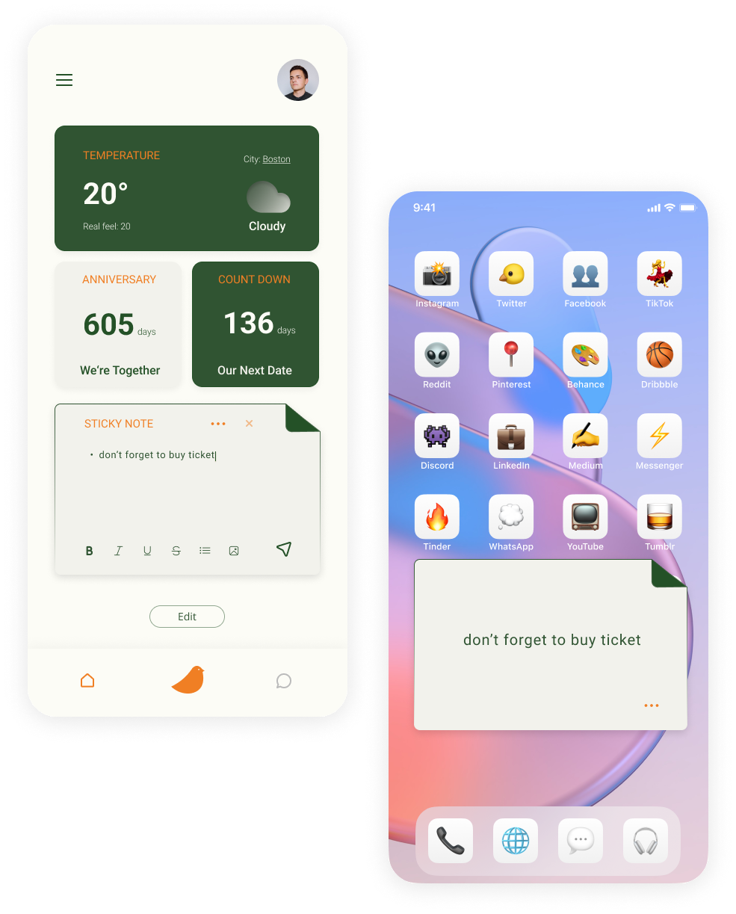

<body>
  

    

  

  

    

    <h1 class="heading-1">Flipped: Connecting Long Distance Lover </h1>
    
Shorten the Distance, Extend your Love.

    
Flipped is a class project practicing solving real world problems for users, my roles are conducting user research, designing user flow, and prototyping solutions. Its target users are long-distance lover.

    

      

        <h1 class="heading-2">My Role</h1>
        
Research &amp; Strategy Product Definition &amp; Design App Prototype Case Study Design

      

      

        <h1 class="heading-2">Timeline</h1>
        
Feb 2022 - May 2022

      

      

        <h1 class="heading-2">Project Type</h1>
        
Individual Project

      

    

  

  

    

      

        

          

          <h1 id="w-node-_0174fe46-6202-2c6b-fe1d-4945ea259824-f6fc21fb" class="heading-3">About Flipped  </h1>
        

        

          
An application designed specifically for long-distance lover

          
Aims to help long distance lover to have more customized chat, connecting experience, AI supported discussion topic generator, and widget generator to better help lovers in their daily life.

        

      

      

    

  

  

    

      

        

          

          <h1 id="w-node-_2cb8d1e7-b9cf-5413-4bb6-9ef8af5ab903-f6fc21fb" class="heading-3"><strong class="title-font">Problem Space</strong>  </h1>
        

        

          
1. 14 million<strong> </strong>people in the US in a long-distance relationship

          
And this doesn’t include the rest of the world or the other 3.37 million people who are married but share a long-distance relationship.

        

        

          

            
Many Couples forced into long-distance relationships by coronavirus pandemic

          

          
The hardness of traveling during covid and lock downs for many countries have worsen the situation for long distance lovers to remain in-person interaction

        

      

    

  

  

    

      

        
<strong class="text">pain points</strong>

        
Physical Intimacy

        
Travel Expenses

        
Struggle with Communication

        
LDR partners might face issues with managing physical intimacy between them as meeting each other frequently may not be possible.

        
The hardness of traveling during covid and lock downs for many countries have worsen the situation for long distance lovers to remain in-person interaction

        
Communication is hard for lovers, but it&#x27;s even harder for long distance lover as there can only connect through screens. 

      

    

  

  

    
Problem statement 

    
How might we help long-distance lovers better communicate and interact online so they can feel attachment from a distance?

  

  

    

      

        

          

          <h1 id="w-node-_4f0ba9a7-78ec-8dfe-9c2f-c5c2f1543d43-f6fc21fb" class="heading-3"><strong class="title-font">Research</strong>  </h1>
        

        

          
User interviews was conducted with 3 couples who have on long-distance relationship from 6 month to 3 years.

          
To learn about pain points and stories they have during their relationship. 

        

        

          

            
Gathered stories and opinion on social media and forum from more lovers 

            
Many long distance lover are willing to share stories online which is helpful for other couples to gain faith

          

        

      

      

        

          
<strong class="text">KEY INSIGHTS</strong>

          
Sense of attachment 

          
Conversations

          
&#x27;Special occasion&#x27; Feeling 

          
Long distance couples find it hard to express their love. They want to find ways to stay connected and be a part of each others daily routine. 

          
Couples who been stay apart for longer time find it hard to find conversation topics all the time. 

          
It&#x27;s easy for regular couple to have dates and create special occasion feeling. But for long distance lovers, it&#x27;s hard to have the feeling. 

        

      

    

  

  

    

      

      

    

  

  

    

      

        

          

            

            <h1 id="w-node-_6094cd4b-c33a-ccf2-01a9-4757c51bb123-f6fc21fb" class="heading-3"><strong class="title-font">Concept  Development</strong>  </h1>
          

          

            
01 Customizable Widget Creator

            
Widget designed for long-distance lovers such as shared memos, last watched video, each other&#x27;s cities&#x27; weather and news, important date count downs, and so much more!

          

          

            

              
02 Conversation Topic Generator

            

            
Based on the topics you set, the movie you watched, or information on the widget, the topic generator will generate some topics for you.

          

          

            

              
03 Tools to help couples spend time together

            

            
Based on the research, many people mentioned as long-distance lover, need to spend time together regularly, but it&#x27;s hard to achieve this goal

          

        

      

    

  

  

    
Wireframing

  

  

    

      

        

          

          <h1 id="w-node-e717bd6d-5332-a0d0-2ee8-520c0eaab55d-f6fc21fb" class="heading-3"><strong class="title-font">User testing</strong>  </h1>
        

        

          
01 Focus more on how to encourage couples to share-time, thoughts, etc

          
The user mention that they think have the desire to share is hard thing when in long distance relationship. When doing usability test, they think this app could potentially help them to share more frequently

        

        

          

            
02 focusing on how to help people have the &#x27;special occasion&#x27; feeling even when they are apart from each other

          

          
One user mentioned the widget help them to remember important dates, but they are lacking the special occasion feeling. When people are together, they can go to movie theater to have time together, but it&#x27;s hard for LDC to do it. 

        

      

    

  

  

  

    

      

        

          

            

              

              <h1 id="w-node-_7fd44b13-2fa5-0ded-d386-11cfd66f1313-f6fc21fb" class="heading-3"><strong class="title-font">Solutions</strong>  </h1>
            

          

          

            
Onboarding

            
Here is where user can put in personal informations such as important dates or topic they are interested in.

          

          

          

            

              
Add the widget best help you

            

            
Based on the problem couples have now with video chatting, designed a new experience for couples to watch video and have conversation together, 

          

          

          

            

              

                
Topic generator

              

              
Based on the problem couples have now with video chatting, designed a new experience for couples to watch video and have conversation together, 

            

          

          

          

            

              

                
Set time to spend together

              

              
Long-distance couples need to spend time together even at a distance. So this feature allows couples to book times to spend together for talks, listen to music, or watch a movie together. The bird will send their invitation and also generate invitation tickets that show on the main screen to create a special occasion feeling.

              

                

                  

                

              

            

          

          

            

              

                
Couple achievements

              

              
Based on the time they spend together or things they do together, the couples will achieve many titles. This is a good way to show the lovers how much they have done together.

              

                

                  

                    

                  

                

              

            

          

        

      

    

  

  

    <h1 class="heading-5">Thanks for watching!</h1>
    

  

  
  
  <!-- [if lte IE 9]><![endif] -->
</body>
